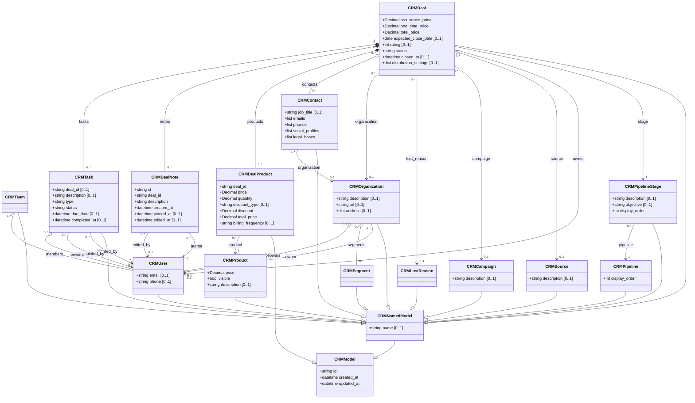
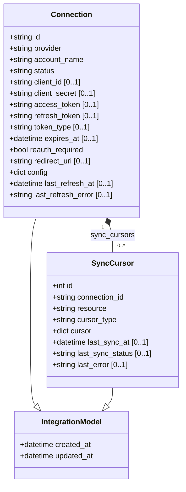

# fluffy-waddle

Shared Pydantic data model for the **modest-galois** project. All Python workers (CRM sync, and future WMS, TMS, ERP integrations) import from this package.

## Class diagram

Each class only shows fields it adds over its parent. Omitted multiplicity means `[1..1]`. `CRMDealNote` inherits from Pydantic's `BaseModel` directly (not `CRMModel`) because the `deal_notes` table has no `updated_at` column. `CRMTask.deal_id` and `SyncCursor.connection_id` are kept as strings to avoid circular imports — navigate those relationships from the parent side.

## Integrations class diagram

> **Tip:** GitHub renders this with dagre and the layout gets crowded. For a clearer view, paste the diagram into the Mermaid Live Editor and switch the layout to ELK.
