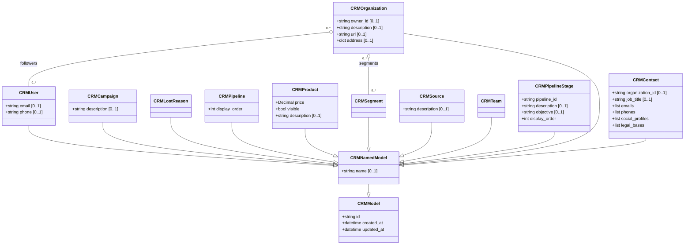

# fluffy-waddle

Shared Pydantic data model for the **modest-galois** project. All Python workers (CRM sync, and future WMS, TMS, ERP integrations) import from this package.

## Class diagram

Each class only shows fields it adds over its parent. Omitted multiplicity means `[1..1]`.
