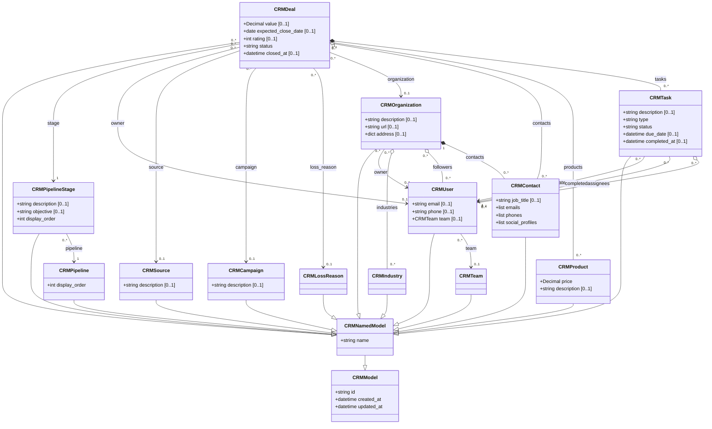
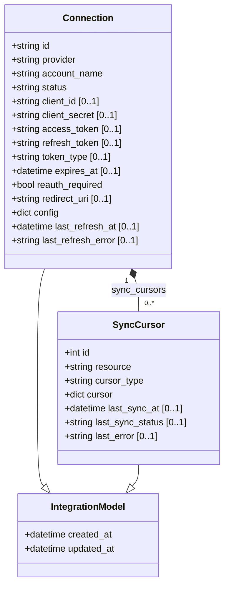

# fluffy-waddle

Shared Pydantic data model for the **modest-galois** project. All Python workers (CRM sync, and future WMS, TMS, ERP integrations) import from this package.

This package stays intentionally **domain-first**: it models nested business objects, not database rows. Names track the database entities, but the public API is a graph of related classes with inheritance and aggregate roots.

## Sales class diagram



`CRMDeal` is the main aggregate root for the sales graph. Child objects nested under a deal (`tasks`) intentionally do **not** carry backreference IDs to the parent deal; workers should navigate outward from the deal graph instead.

## Integrations class diagram



`Connection` is the aggregate root for integrations. `SyncCursor` objects are nested underneath it, so the public model avoids a `connection_id` backreference.

> **Tip:** GitHub renders this with dagre and the layout gets crowded. For a clearer view, paste the diagram into the Mermaid Live Editor and switch the layout to ELK.

## Testing

Tests validate the full insert/assemble roundtrip against a live Postgres database seeded with JSON fixtures.

Spin up the database and run migrations (uses `curly-spoon` to apply the full schema):

```bash
docker compose up -d
```

Then run pytest from inside the `app` container:

```bash
pytest tests/
```

The `app` service mounts the repo at `/root/app` and loads `.env` (Postgres connection vars) automatically.

### Test structure

```
tests/
  data/           # JSON fixture files (one per entity type)
  map_makers.py   # builds domain models from raw fixture data
  inserter.py     # writes domain models to the DB
  selector.py     # reads raw rows back from the DB
  assembler.py    # reassembles domain models from raw rows
  deals_repository.py  # aggregate read/write repository for the deals graph
  test_deals.py   # roundtrip: insert fixtures → fetch → assert equality
```

`CRMDeal` is the aggregate root tested here. The roundtrip covers the full sales graph: pipelines, stages, organizations, contacts, products, tasks, teams, users, and all bridge tables.
